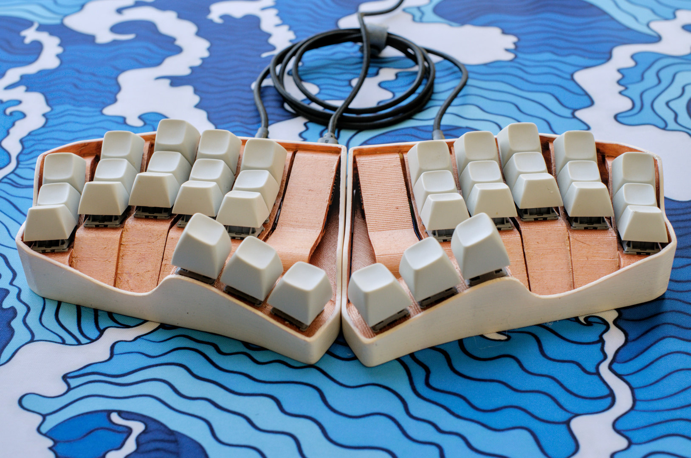

# Spline36 Keyboard

## 📻 Project Description

The Spline36 is a 36-key ergonomic split keyboard. 

The columns are staggered, slightly splayed or fanned out, and there is an angle to the top and bottom row to create a key-well effect. Similarly the thumb cluster is offset and angled to fit under the thumb in a more natural position.

Beneath the plate, all the keys are connected directly (no diodes) to a RP2040 based MCU with a USB-C connector. The two halves are connected via TRRS. The bottom plate is fastened via M2 screws and heatset inserts. 

[Continue reading...](notes/Design.md)

## 🧰 Features
- 36 keys
- 2× RP2040 w/ USB-C
- TRS split cable
- Powered by QMK with Vial support

## 📚 Read more...
- [Design](notes/Design.md)
- [Construction](notes/Construction.md)
- [Firmware](notes/Firmware.md)
- [Gallery](notes/Gallery.md)

## 🙏 Inspired by...
- [Chortyl by jdart](https://github.com/jdart/chortyl)
- [TBK Mini by BastardKB](https://github.com/Bastardkb/TBK-Mini)

## 📐 References
- [Waveshare RP2040-Zero](https://www.waveshare.com/rp2040-zero.htm)
- [QMK Firmware](https://docs.qmk.fm/)
- [Vial Firmware](https://get.vial.today/)

---