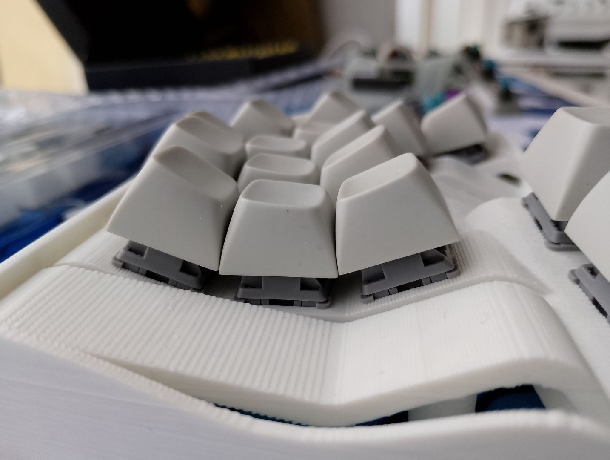
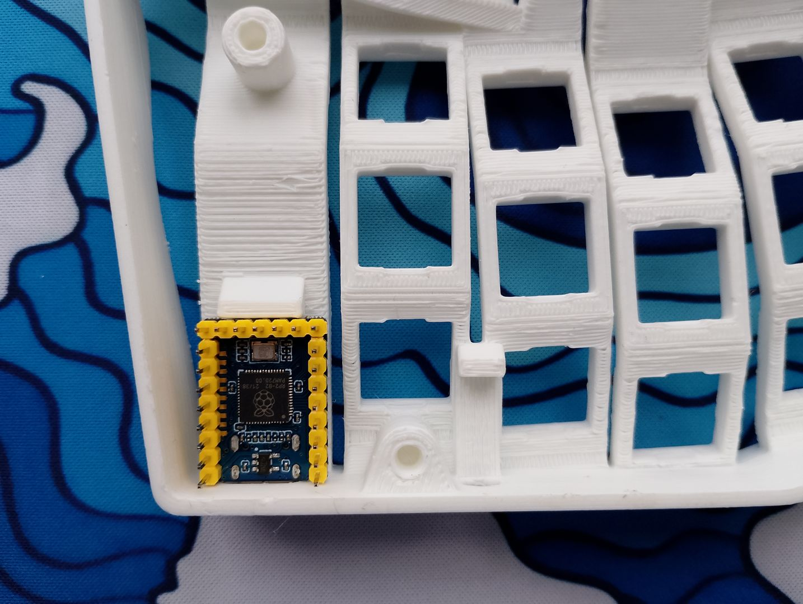
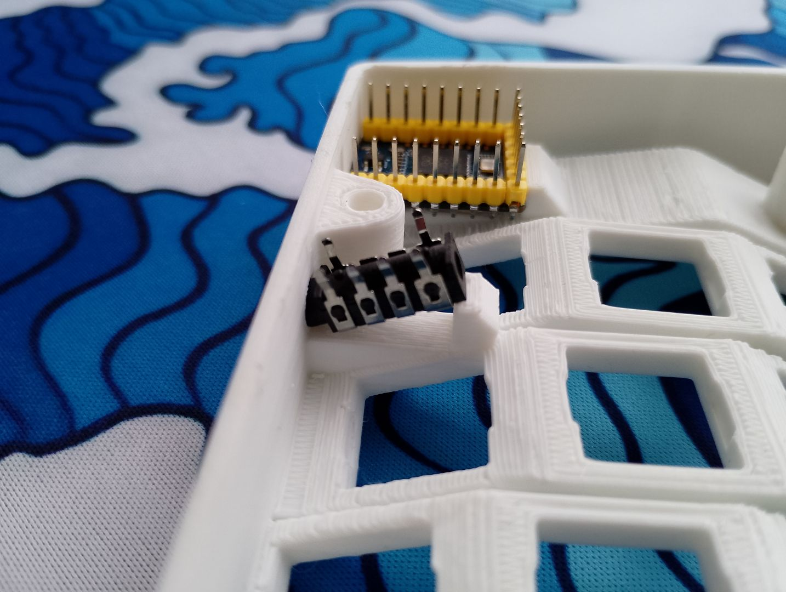
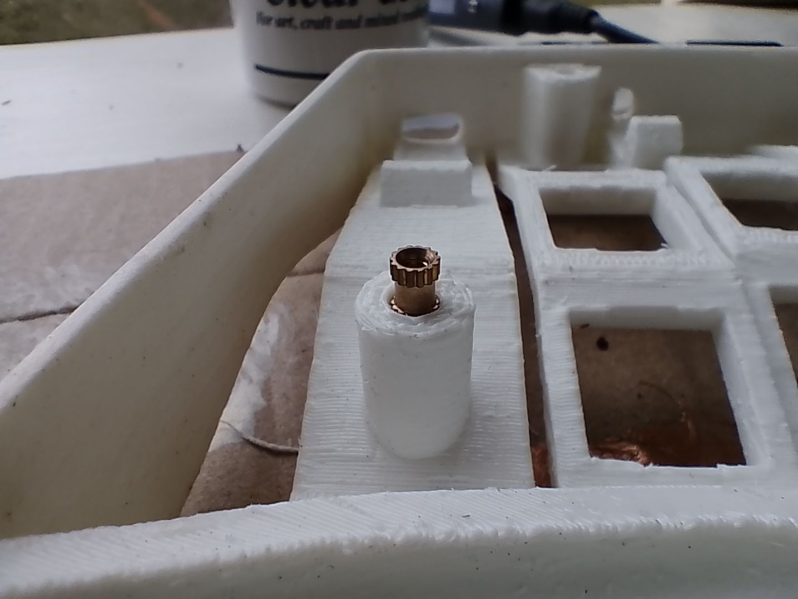
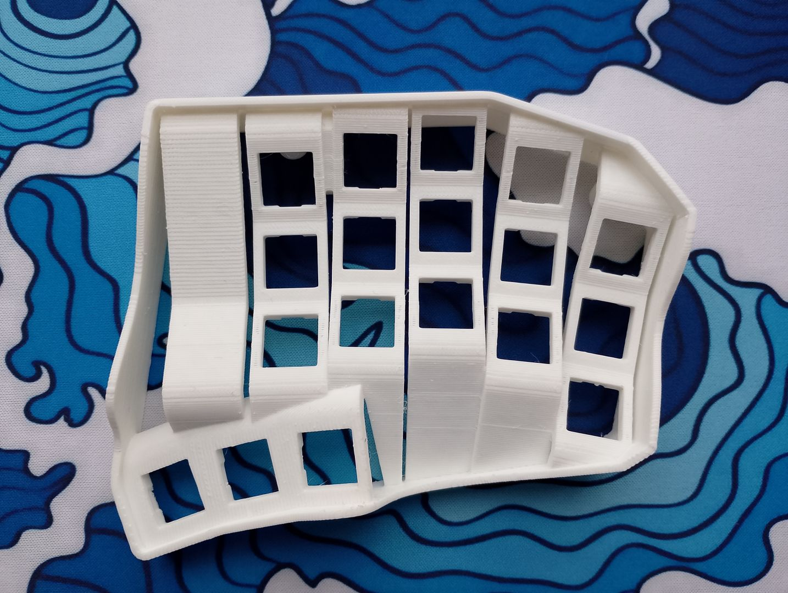
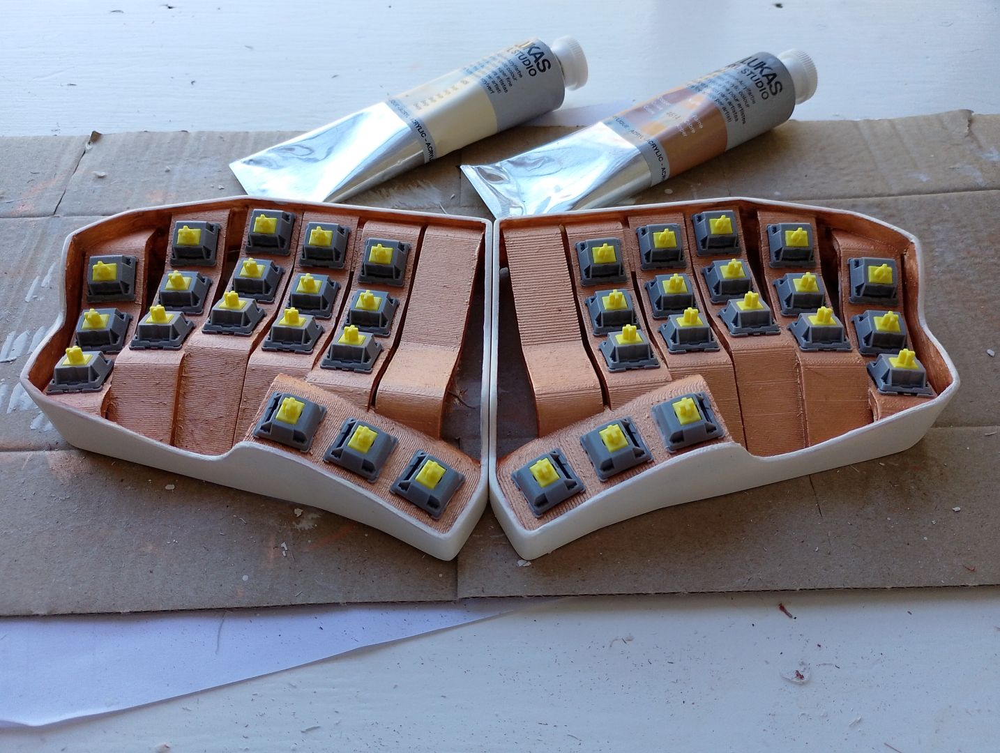

# Construction

## 🛒 Bill of Materials (BOM)

| Item | Size | Qty | 
| ---- | ---- | --- |
| Waveshare RP2040-Zero | N/A | 2 |
| MX Switches | N/A | 36 |
| Heat Set Inserts | M2 ø3.5×5mm | 10 | 
| Screws, Countersunk | M2 | 10 |
| TRRS Jacks | PJ-313B | 2 |
| TRRS Cable | M-M | 1 |
| Wire | 30AWG | N/A |
| 3D printed shell | N/A | 4 pcs |

## Tolerances
**IMPORTANT**: The current FreeCAD files and .stl models have an issue where the clearance between the keys is too tight, and keycaps will likely bind and chafe against each other:

This is not enough to cause accidental actuation of adjacent keys. I'm still experimenting to see how bad the feel is in practice.

## Wiring
With only 18 switches per side and no accessories like OLEDs or LEDs, there are enough GPIO pins to wire each switch directly to the MCU. 

This means each pin has one wire going to a GPIO pin, and a second wire that goes to ground. To manage the ground wires, I used a spare piece of header pins with at least 7 pins. On the short side I shorted all the pins together and wired these to the MCU's GND pin. The long sides were connected to a common wire on each key column, and the 7th pin provided a GND for the TRS jack used to connect the split halves.

## Parts
The MCU fitted perfectly: both the USB jack fits in the hole in the shell, a USB cable can fit through and connect to it, and the MCU itself fits flush against stopper. 

The purpose of this stopper is to prevent any lateral movement when inserting the USB cable. It prevents the MCU from being pushed in the direction you are pushing the cable and accidentally being dislodged.

Unfortunately, the dimensions for the TRRS jack were too tight. Coincidentally, while building the keyboard, I realised I only have *TRS* cables and no *TRRS* cables. I changed to TRS jacks instead, which are a fair bit shorter and can thus fit in easily.

The gap between the new TRS jack and the stopper can be filled with hot glue - just seal off the hole on the back of the TRS jack first with something like insulation tape to prevent ingress of the glue. Again, this is so that when inserting a cable, the stopper prevents the jack from sheared off whatever glue might be holding it down.

## Heat-set Inserts
I settled for only 4× M2 screws to hold the bottom plate in place, and it is working perfectly fine. M2 means smaller heat-set inserts, which means whichever part you place them in needs less wall thickness to absorb extra heat when melting them in.

When designing the holes to insert the heat-sets, remember to taper the entrance to help align them. If you have a craft knife set, a straight chisel tip blade is useful for making sure it sets in place level.

Don't forget to apply a taper to the plate side as well, so that the heads of your screws sit flush with the surface.

## Sanding and Painting
I had the case printed in PLA with a 0.12mm layer resolution. I was happy with how it came out, but I wanted to add some colour to it.

I sanded the outer shell with several different grits (180, 320 and 600 if I recall correctly). I didn't sand the key columns, as the shape was too awkward to get into. Luckily the grain of the print was just how I wanted it.

I then applied several coats of primer to the outer shell. For the bottom plate, I primed the face that would be facing upwards and through the keyboard.

Once the surface was primed, I applied several coats of acrylic paint. I should have thinned the paint a bit more, but I am still happy with how the final result turned out.

Some advice: keep any eye out for burrs, dust and hairs before painting *and* while painting. A single strand of hair from your paintbrush can get stuck on without you noticing and blemish the paint job.

---

⏪ [Design](Design.md) | ⏯️ *Construction* | ⏩ [Firmware](Firmware.md) | ⏏️ [README.md](../README.md)