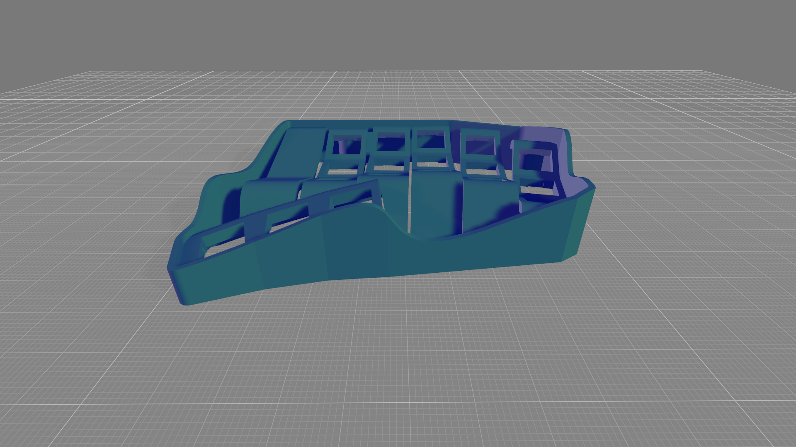
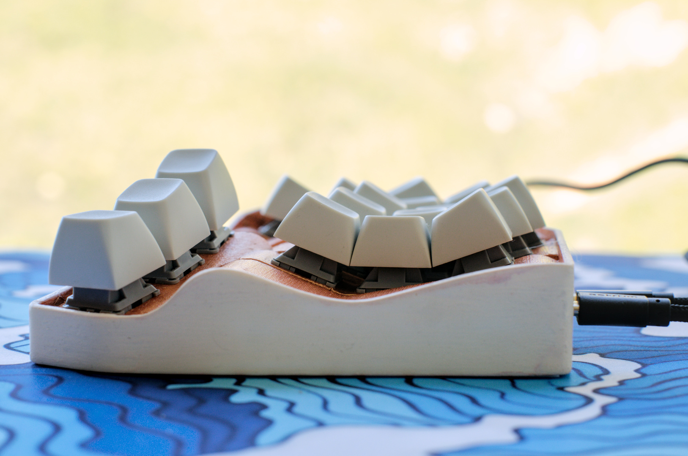
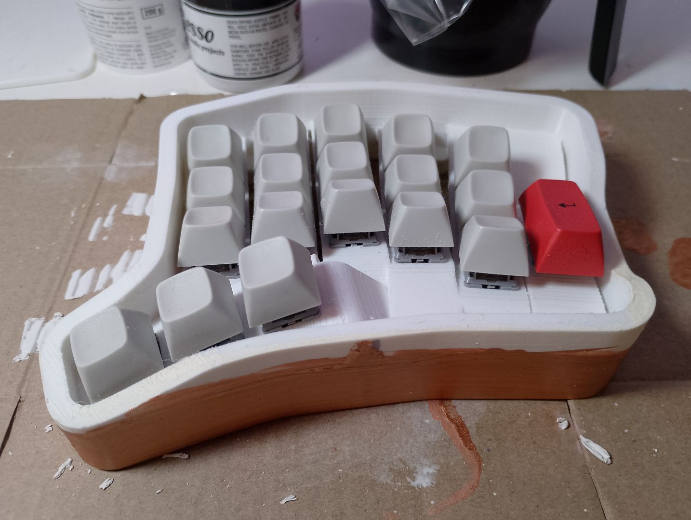
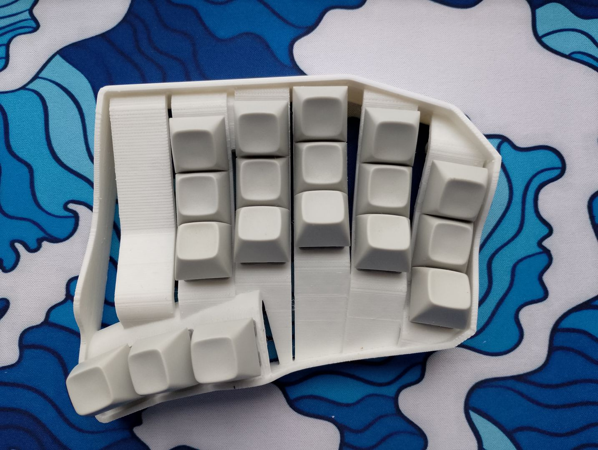
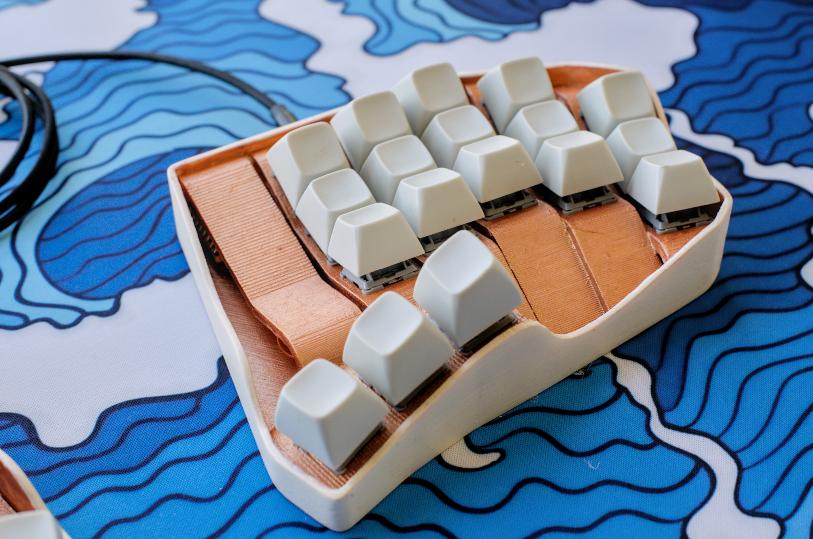

# Design

## Spline?

The name "Spline36" comes from the shapes I used for the shell around the keyboard. I usually stick to orthogonal lines when making keyboards, but this time I decided to take the time and practice working with more organic shapes and slopes in all three dimensions.

While I could of used a generator like [Ergogen](https://github.com/ergogen/ergogen) or [ryanis.cool's Cosmos](https://ryanis.cool/cosmos/), I stubbornly wanted to place everything myself. All in all, I think it came out really nicely.

## Inspiration

I have a [TBK Mini](https://github.com/Bastardkb/TBK-Mini) that I use, and I especially like the design Quentin used for the columns, where each key column appears to be a separate part that was rotated and moved around freely, and then held together by an outer frame.  As things go, the TBK didnt't fit to my hand exactly, but at the time it didn't bother me enough to build something new.

Next I saw photos of [jdart's Chortyl](https://github.com/jdart/chortyl) and instantly fell in love with the design. Unfortunately 34-keys are a *bit* too few for me, and I still wanted something that is custom tailored for my own hands.

## Initial Designs

The previous keyboard I made was my [Shifty Split](https://github.com/ceybers/shifty-split-keyboard), and there were a few changes I wanted to make. The thumb cluster needed to be moved further inwards, the column stagger was nowhere near aggressive enough for my pinkies, I wanted to try out some splay/fanning, and the experiment of the outer column arrow clusters didn't work out as well as I had hoped.

Initially I started on just making these changes, but I still wanted to make something with a key-well, where the top and bottom rows are angled like the examples I linked above. This of course meant starting an entirely new model from scratch.

## First Revision

The first revision of the Spline had a 6th column with a single vertical 2u key. This doubled as being space to place the MCU and TRRS jack on the underside of the empty space above the 2u key.

I am a firm believer in vertical 2u keys in monoblock keyboards, as I can instinctively hit the numpad Enter key with my right hand while using the mouse. I also find it convenient to be able to just hit the rightmost key with my thumb when my hands are off the keyboard.

Of course most of this doesn't really apply when using split keyboards, as the mouse or trackball usually goes *inbetween* the halves. 

Having outer keys could still work for hands-off thumb presses, but they don't really fit in with how I use the keyboard when actively typing. I definitely didn't want to use them with my pinkies either - I'm trying to place more of the keyboard work on my thumbs, index and middle fingers.

## Second Revision

I decided to move the MCU to the traditional location for split keyboards: inwards in the column to the side of the index finger key column, above the thumb keys. 

It turns out that the columns I was using for the keys is not only just the right width, it is also high enough off the floor that the MCU can fit beneath it, even with vertical header pins soldered on.

I also reduced the wall thickness from an overly chunky 5mm to a more reasonable 3.6mm. Adding some more angle to the different columns made the case feel more open, especially with the way the outer shell folds around the inner column, which shows off the bottom plate nicely.

---

⏯️ *Design* | ⏩ [Construction](Construction.md) | ⏏️ [README.md](../README.md)